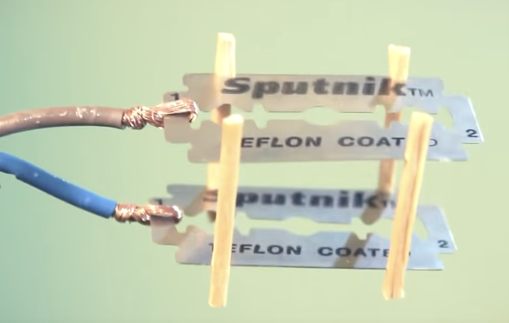

# Survival

Collection of information to survive in a blackout or in the wild for some time.

- Cooking water with only one wire and 2 razor blades
	
- Recommendation of german disaster control [checklists](https://www.bbk.bund.de/DE/Warnung-Vorsorge/Vorsorge/Ratgeber-Checkliste/ratgeber-checkliste_node.html)