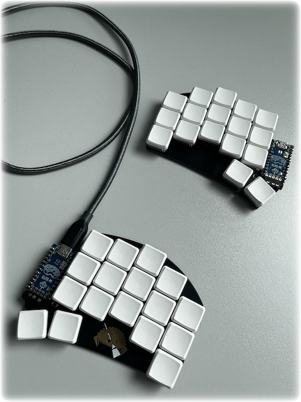

# Split keyboard

For my first try, I build a ferris sweep with Kailh Low Profile Choc Switches, Blank MBK Choc Low Profile Keycaps and two Elite-Pi controllers from splitkb.com.

Some more details about my walkthrough this journey and its actual state:

1. Get your ferris sweep [pcb](https://github.com/davidphilipbarr/Sweep), got my from a friend @mberrio
2. buy all the [components](https://github.com/davidphilipbarr/Sweep#components-list), i.e. here [splitkb.com](https://splitkb.com)
3. solder this on your pcb, [howto](https://github.com/davidphilipbarr/Sweep#how-do-i-make-this-thing)

After finish the hardware, you have to flash your controllers. For me its two Elite-Pi controllers on my sweep (left & right).

1. install [qmk](https://docs.qmk.fm/#/getting_started_build_tools) and test the first compile
2. create a keymap with [configurator](https://config.qmk.fm/#/ferris/sweep/LAYOUT_split_3x5_2)
3. set handedness to elite-pi with
```bash
make CONVERT_TO=kb2040 ferris/sweep:default:uf2-split-left
make CONVERT_TO=kb2040 ferris/sweep:default:uf2-split-right
```
4. each command creates a `.uf2` file, that the firmware file for each side to be _configured once_ on each side
5. plug-in each controller (first time starts in [boot mode](https://docs.keeb.io/elite-pi-guide#flashing)) and copy `.uf2` to DF2 usb storage (it restarts & flash automatically)
6. create firmware, i.e. like this
	`qmk compile -kb ferris/sweep -km default -e CONVERT_TO=elite_pi`
7. copy created `.uf2` file to each controller

After flashing your have a running ferris sweep split keyboard, which you must now learn to love. Take a lot of time to get to know each other ...

Play around with the configurator and create your own `keymap.json` file. If you ready to learn, print your keymap [here](https://caksoylar.github.io/keymap-drawer) and start typing.

Articles:
- [oppi - ferricy](https://oppi.li/posts/programming_on_34_keys/)

Tools:
 - [keybr.com](https://www.keybr.com)
 - https://monkeytype.com/

